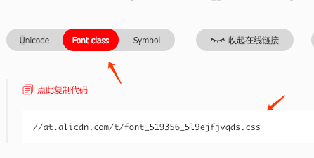

## iconfont-download

> 思路参考https://blog.csdn.net/shentibeitaokong/article/details/82463941

下载根据生成的css url，自动下载 iconfont.cn 项目中的其他资源。





## 用法

1. 全局安装 ```npm i iconfont-dl -g```
2. 输入命令下载 ```iconfont-dl <path to icons>```